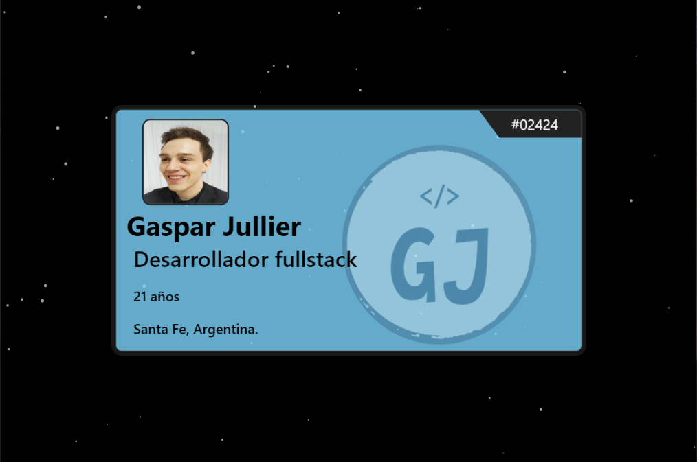

# Mi Web Frontend

#### Sitio web personal desarrollado en Angular con conexión API (Java backend) para obtener informacion mostrada en la pagina desde una base de datos (MySql)

[CLICK para visitar sitio](https://gasparjullier.up.railway.app/)

## Development server

Run `ng serve` for a dev server. Navigate to `http://localhost:4200/`.
